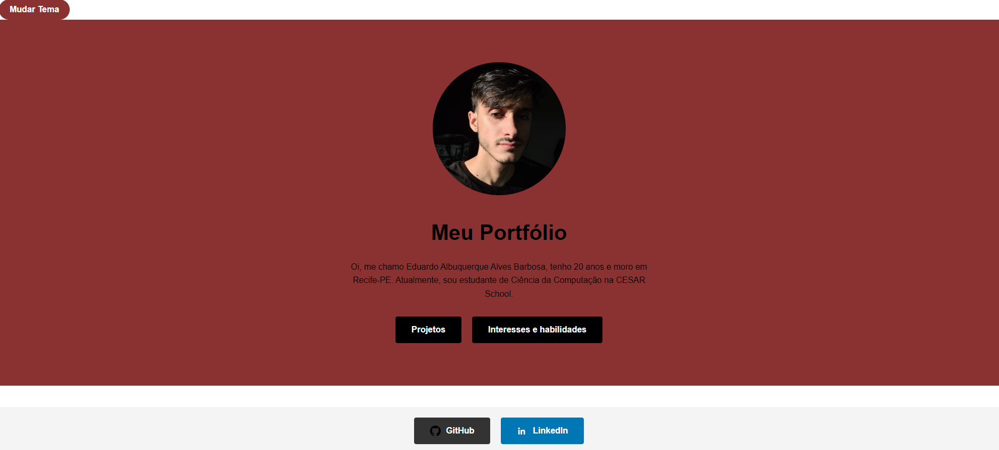
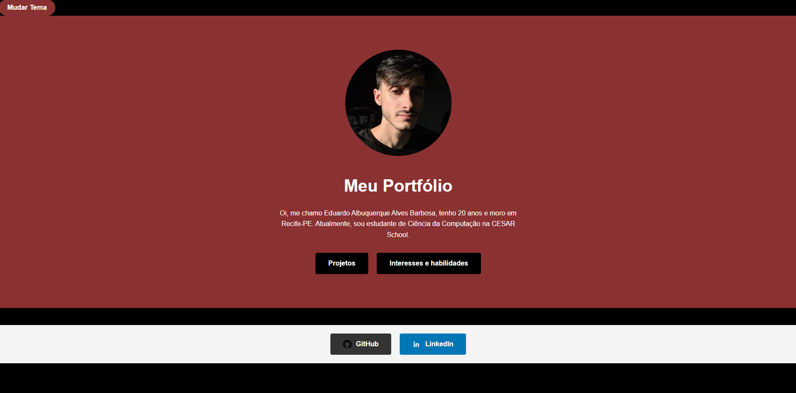
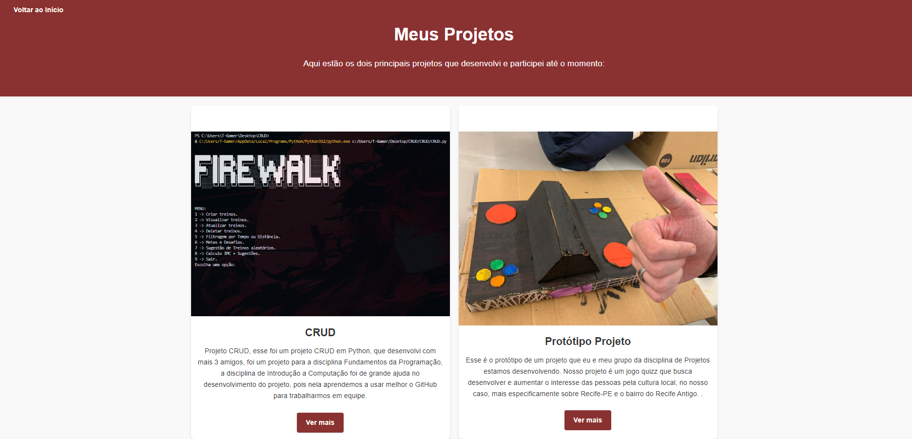
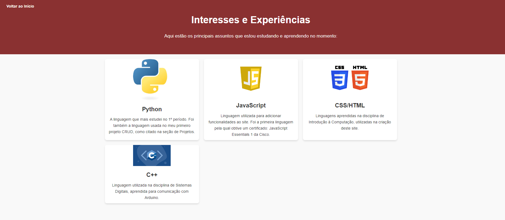
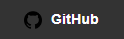

# Site Portfólio

Esse é um site que fala um pouco sobre mim, mostrando alguns dos meus projetos e interesses.

## Página principal
A página principal mostra uma foto minha, com um breve resumo sobre mim e da opções para o usuário interagir com algumas funções, por exemplo, mudar o tema ou ir para outro site.

## Modo Escuro

## Meus Projetos
Essa página mostra meus dois principais projetos até o momento, podendo clicar no botão "Ver Mais" para poder ver mais detalhadamente os projetos ou podendo voltar para a página principal.

## Interesses e Experiências
Nessa página eu falo sobre minhas experiências com linguagens até agora.

## Redes Sociais
Você pode ver minhas redes sociais clicando no botão GitHub ou Linkedin, que estão na página principal.

